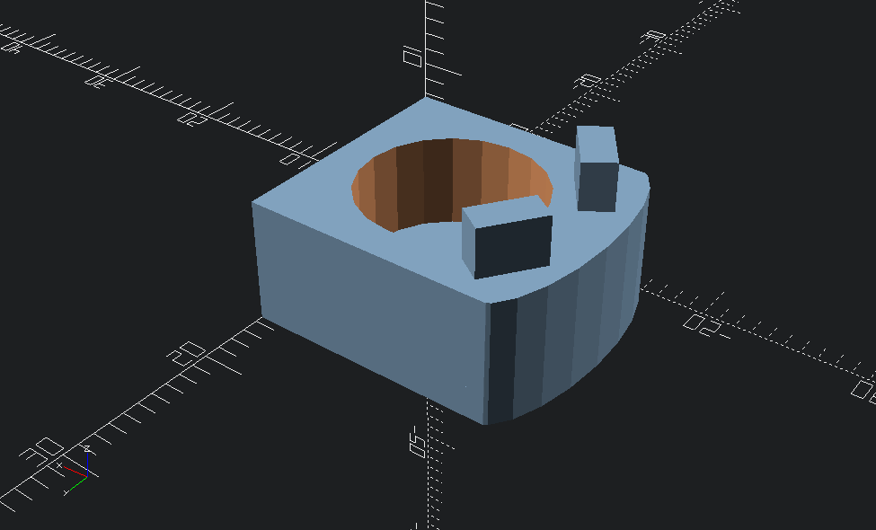
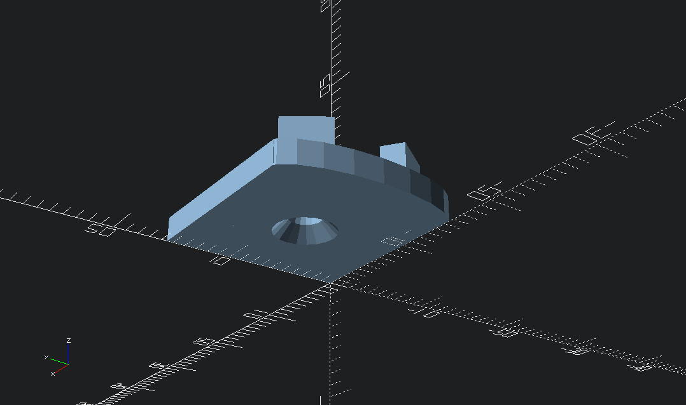
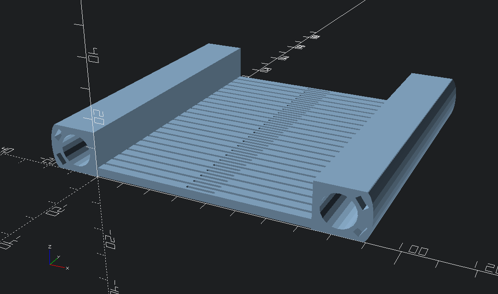
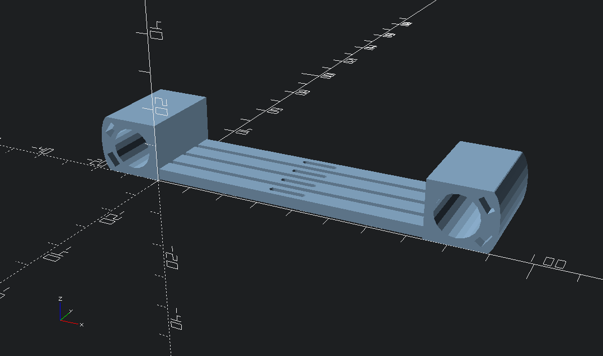
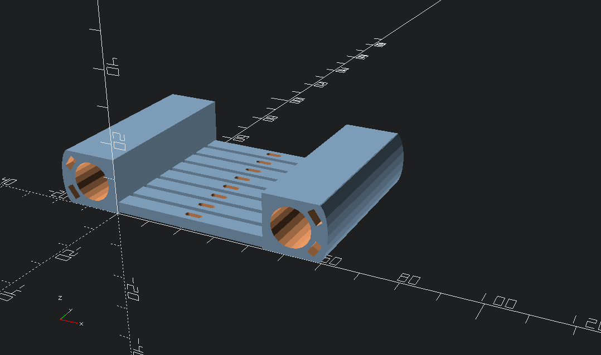

# Parametric heddle

A set of OpenSCAD files for generating a heddle suitable for 3D printing. This heddle fits nicely into the heddle braces of this [rigid heddle weaving loom on Thingiverse](https://www.thingiverse.com/thing:490467).

You can configure various things like:

* the thickness of the dowel that runs the length of the heddle
* the height of the entire heddle (fun fact: I created these files because the build volume of my printer was slightly too small for the original heddle in the above project)
* the thickness of the reed
* the height of the reed holes
* reed dent count (threads per inch)
* the length of a heddle screen in inches

This design is a bit different from the original:

* The reeds are centred in the panel, so you don't have to worry about whether the file you're printing is a left or a right.
* It's meant to be assembled without screws if you like -- instead, you print out dowel end-caps and pressure-fit them into the screens at the ends of the dowel. There are little notch/tongue fittings to keep the thing from swivelling on the dowel, and to hopefully provide a little more pressure-fitting. (Note that, by default, the end-caps are configured to have American #3 countersunk screw holes so you can screw them together if you like.)
* Because it's parametric and goes together with pressure fittings, this design is explicitly meant to let you assemble and reassemble variable-dent heddles of whatever configuration you like. Two inches of six-dent followed by one inch of twelve-dent? Go for it?
* All pieces are completely symmetrical, so you don't need to generate left and right models.

## Usage

Just open up `heddle.scad`, scroll down to the line where it says to uncomment various lines in order to generate models, and hit F6!. There are preconfigured lines for a heddle screen panel, a top dowel cap, and a bottom dowel cap.

To configure things, read all the documentation in the comments. It's quite well-documented (if you find something doesn't make sense, please open up a GitHub issue!) The parameters you'll probably wanto to change are `heddle_height`, `reed_dent`, and `screen_inches`.

## Examples

A bottom dowel cap, with #3 screw hole and tongues to fit into the screen handle. This is sized to match the original heddle design, in which the bottom handle pokes out past the last reed by about 8mm.

A top dowel cap, which is basically just a thin panel with tongues and a screw hole. You might want to screw this one into the dowel if the pressure fitting isn't enough.

A 12-dent screen four inches long.

An 8-dent screen one inch long.

An 8-dent screen only 70mm tall and two inches long.

